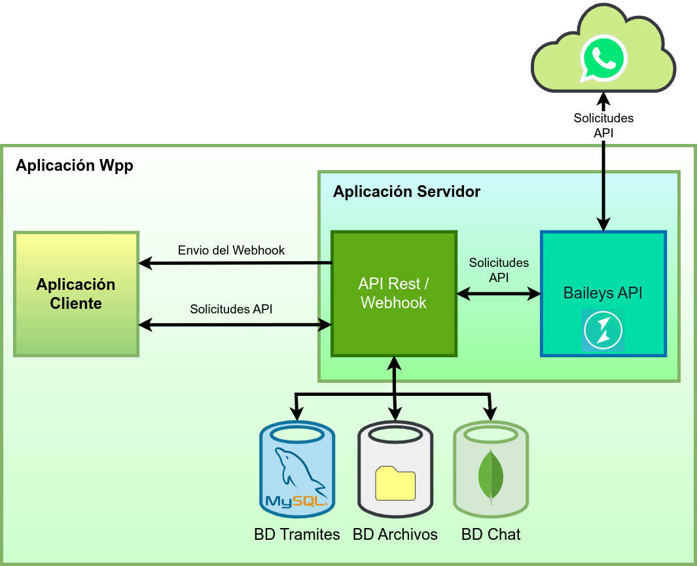

# TramiTack - Gestión y Monitoreo de Trámites vía WhatsApp

TramiTack es un sistema diseñado para automatizar el seguimiento de trámites solicitados en un ciber, optimizando la comunicación con los usuarios a través de WhatsApp. 
La aplicación permite a un administrador gestionar las solicitudes en un grupo de negocio de WhatsApp, almacenar los registros en una base de datos y visualizar la información en una interfaz web.

## ⚙️ Características
- Integración con **WhatsApp** mediante **Baileys API** para capturar solicitudes.
- Almacenamiento de datos en **MySQL y MongoDB**.
- Interfaz web para el monitoreo de trámites.
- Comunicación en tiempo real con **Socket.IO**.
- Backend desarrollado en **Flask y Node.js**.

## Arquitectura
En el siguiente diagrama se muestra el diseño y la comunicación entre los componentes del sistema:
- El servicio captura y filtra los mensajes de un grupo de WhatsApp mediante la API de Baileys.
- Los datos se almacenan en MongoDB para generar estadísticas sobre los archivos enviados por los miembros del chat.
- La información relacionada con los trámites y archivos se registra en una base de datos MySQL, y los medios se almacenan para su posterior distribución a los usuarios.
- Cada mensaje procesado se reenvía automáticamente a la interfaz dedicada para el administrador.

  

## 🛠️ Tecnologías Utilizadas
| Categoría                    | Tecnologías                            |
|-----------------------------|-----------------------------------------|
| **Backend**                 | TypeScript, Python (Flask), Node.js (Express) |
| **Base de Datos**           | MySQL, MongoDB                          |
| **Frontend**                | HTML, CSS, JavaScript                   |
| **Comunicación en Tiempo Real** | Socket.IO                          |
| **Integración con WhatsApp**| Baileys API                             |
